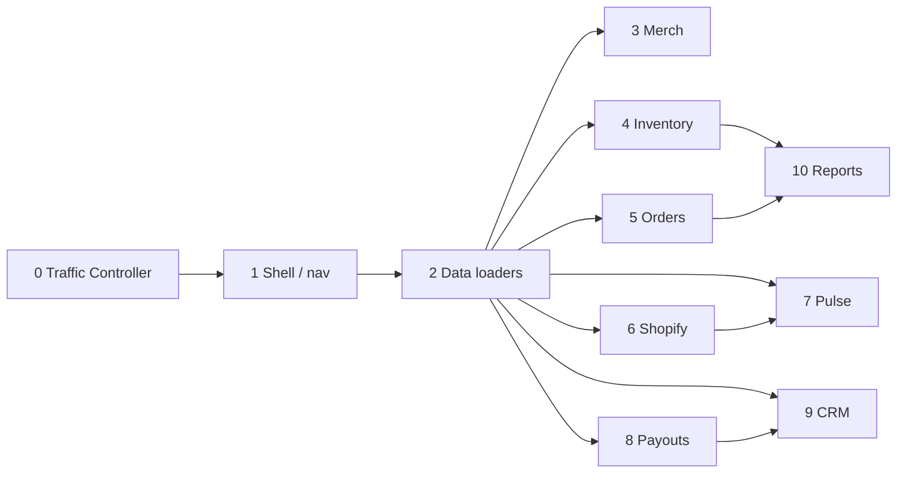

# Merge order — twin parity waves

Dependency order for integrating sandbox PRs. Later waves may start coding in parallel but **must not merge** until prerequisites land (or rebase onto them).

```
nav/shell → data loaders → merch → inventory → orders → shopify → pulse → payouts → CRM → reports
```

Rep-facing pages merge with their domain wave (not a separate late mega-PR), except leftover routes under `sandbox/rep/*`.

---

## Wave 0 — Traffic Controller (anytime)

| Merge | Branch example | Why first |
|-------|----------------|-----------|
| Docs + QC harness | `sandbox/traffic-controller` | Gates and path contracts for the fleet |

Rollback: revert docs commit; smoke script removal if needed.

---

## Wave 1 — Nav / shell (**CRITICAL PATH — merge first**)

| Order | Branch (actual tip) | Unlocks |
|-------|---------------------|---------|
| 1.1 | `sandbox/shell/nav-and-admin-layout` @ `7368dbc` | Grouped ADMIN_NAV, pending-lane middleware, AppShell — **merge before all domain lanes** |
| 1.2 | `sandbox/shell/dev-auth-login` (planned) | Audit login without Clerk for local twin |

**Do not** let domain PRs rewrite `nav.ts` — open a shell follow-up instead.

---

## Wave 2 — Data loaders

| Order | Branch example | Unlocks |
|-------|----------------|---------|
| 2.1 | `sandbox/data/seed-shape-normalize` | Live-shaped getters in `data.ts` (fixes QC-001–005 class bugs) |
| 2.2 | `sandbox/data/ingest-live-2026-09-16` | Seeds refreshed from `exports/.../live/` |

**Hard gate:** table UI PRs that assume live headers wait for 2.1.

---

## Wave 3 — Merchandising

| Order | Branch example |
|-------|----------------|
| 3.1 | `sandbox/merchandising/admin-table-headers` |
| 3.2 | `sandbox/merchandising/period-switcher` |
| 3.3 | `sandbox/merchandising/rep-field-page` |

Depends on: Wave 2. Independent of inventory once seeds exist.

---

## Wave 4 — Inventory

| Order | Branch example |
|-------|----------------|
| 4.1 | `sandbox/inventory/levels-table` |
| 4.2 | `sandbox/inventory/ledgers-table` |
| 4.3 | `sandbox/inventory/transfers-table` |
| 4.4 | `sandbox/inventory/warehouses-table` |
| 4.5 | `sandbox/inventory/brand-levels-refresh` |
| 4.6 | `sandbox/inventory/audit-stub` |

Depends on: Wave 2. Prefer 4.1 before transfers/ledgers if sharing inventory nav helpers (`inventory-nav.ts` is shell-owned — request shell PR if cluster links change).

---

## Wave 5 — Orders

| Order | Branch example |
|-------|----------------|
| 5.1 | `sandbox/orders/admin-po-table` |
| 5.2 | `sandbox/orders/drafts-and-detail` |
| 5.3 | `sandbox/orders/rep-orders-parity` |

Depends on: Wave 2. Can merge in parallel with Wave 4 if paths stay disjoint.

---

## Wave 6 — Shopify / brands

| Order | Branch example |
|-------|----------------|
| 6.1 | `sandbox/shopify/stores-and-health` (`65619d7`) — preferred actual tip covering health + brand stores |
| 6.2 | `sandbox/shopify/health-table` / `brand-stores-registry` (planned names; skip if 6.1 already landed paths) |
| 6.3 | `sandbox/shopify/sync-status-stub` |
| 6.4 | `sandbox/shopify/webhooks-automation-logs` (`a0da9c7`) — **merge only after 6.1** (`stores-and-health`) |

Depends on: Wave 2. Prefer after inventory refresh page (4.5) if linking health → brand levels; otherwise parallel OK.

**Registered (do not merge early):** `sandbox/shopify/webhooks-automation-logs` @ `a0da9c7` depends on `sandbox/shopify/stores-and-health` @ `65619d7`. Parent lineage is from stores-and-health. Keep out of data/merch/inventory integration waves.

---

## Wave 7 — Pulse / dashboard

| Order | Branch example |
|-------|----------------|
| 7.1 | `sandbox/pulse/signals-kpis` |
| 7.2 | `sandbox/pulse/dashboard-hub` |

Depends on: Wave 2. Optional soft-dep on ledger/orders seeds for dashboard cards.

---

## Wave 8 — Payouts / finance

| Order | Branch example |
|-------|----------------|
| 8.1 | `sandbox/payouts/tables-seed` |

Depends on: Wave 1–2. Live captures thin — seed stubs acceptable for parity scaffolding.

---

## Wave 9 — CRM / assignments

| Order | Branch example |
|-------|----------------|
| 9.1 | `sandbox/crm/users-table` |
| 9.2 | `sandbox/crm/rep-assignments-page1` |
| 9.3 | `sandbox/crm/retail-stores-stub` |

Depends on: Wave 2. `businesses` page: if inventory already owns it, CRM links only; else CRM may own listing under allowed CRM globs — Traffic Controller resolves ownership conflicts.

---

## Wave 10 — Reports

| Order | Branch example |
|-------|----------------|
| 10.1 | `sandbox/reports/hub-and-runners` |

Depends on: Waves 4–5 preferred (reports read inventory/orders concepts). Can stub earlier but merge last among core ops domains.

---

## Integration diagram



---

## Cutover note

Parity freeze = all waves through 10 green on QC gates with seed-backed tables for captured live routes. Improvements remain in [`../IMPROVEMENTS-BACKLOG.md`](../IMPROVEMENTS-BACKLOG.md) until after mirror works.
