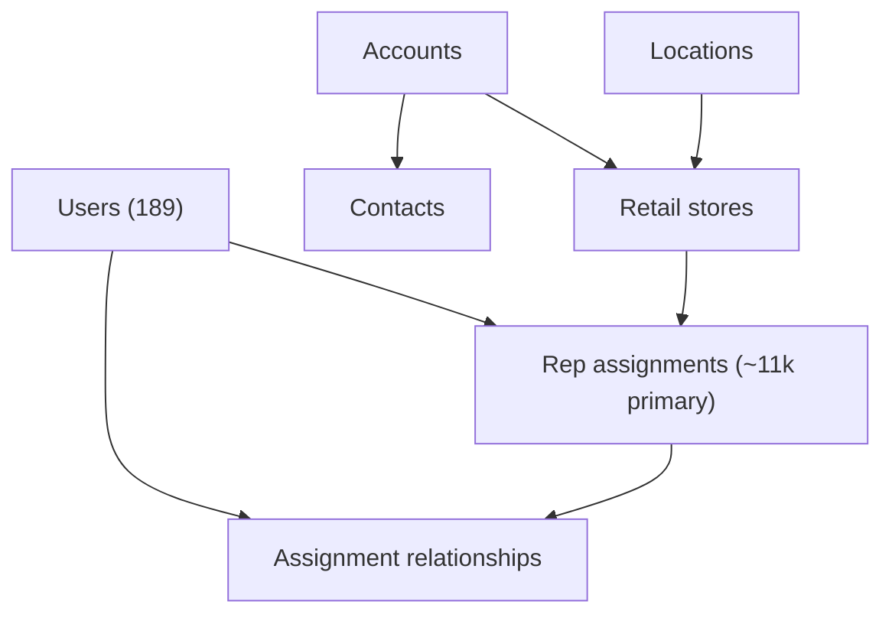

# CRM / Assignments domain map

**Live app:** https://app.direct2retailers.com  
**Domain:** `crm-assignments`  
**Mapped:** 2026-09-16  
**Machine map:** [`interactions.json`](./interactions.json)  
**Improvements:** [`IMPROVEMENTS.md`](./IMPROVEMENTS.md)  
**Canonical merge target:** [`../../SITE-MAP-INTERACTIONS.json`](../../SITE-MAP-INTERACTIONS.json)

Coverage legend: `captured` · `mapped-ui-only` · `stub-in-twin` · `missing`

Interaction fidelity this pass: **mixed** — two routes have live table captures; five are inferred from route discovery + nav/module patterns (no authenticated CDP control scrape for CRM list pages).

---

## Domain purpose

CRM / Assignments is the **territory and identity layer** for Direct2Retailers: who works which doors, under what role, for which account/location. It feeds orders (Sales Rep column), inventory/warehouses (rep linkage), merchandising (rep × store programs), pulse (active stores), and rep-facing store lists.

**Do not confuse:**

| Live route | Meaning |
|------------|---------|
| `/admin/stores` | **Brand Shopify shops** (29 domains) — `shopify-brands` domain |
| `/admin/retail-stores` | **Physical doors / retail CRM stores** — this domain |
| `/admin/businesses` | Legal entities for reps (51 captured) — adjacent CRM, inventory domain |

---

## Entity graph (inferred)



**Scale anchor (2026-09-16 live scrape):**

| Entity | Live count | Capture |
|--------|------------|---------|
| Primary assignments | **11,314** | page-1 sample (50 rows) · ~227 pages |
| Covering assignments | 27 | meta only (role filter count) |
| Delegate assignments | 464 | meta only |
| Users | 189 | full capture |
| Accounts | unknown | no capture |
| Contacts | unknown | no capture |
| Retail stores | unknown (likely ~11k doors) | no capture |
| Locations | unknown | no capture |

Pagination math: 227 pages × ~50 rows ≈ 11,350 rows, consistent with 11,314 active primary assignments.

---

## Admin nav cluster (live)

Inferred from `URLS.txt` + live module layout. Twin `ADMIN_NAV` currently lists **Users only**; CRM list routes are missing from twin nav.

```
CRM / Users (admin)
├── Users                             /admin/users
├── Accounts                          /admin/accounts
├── Contacts                          /admin/contacts
├── Locations                         /admin/locations
│   └── Import (related)              /admin/locations/import
├── Retail stores                     /admin/retail-stores
└── Rep assignments                   /admin/rep-assignments
    └── Relationships                 /admin/rep-assignments/relationships
```

**Rep-facing counterparts (out of scope, cross-linked):** `/retail-stores`, `/locations/sales-status`

---

## Route inventory

### `/admin/users`

| Field | Value |
|-------|-------|
| **Purpose** | User directory — reps, delegates, admins, brand partners |
| **Coverage** | `captured` + `stub-in-twin` |
| **Live capture** | `exports/2026-09-16/live/users-live.json` (189 rows) |
| **Twin** | `d2r-app/src/app/admin/users/page.tsx` — partial (Name/Email/Role only; missing Last Seen, Created) |
| **Seed** | `d2r-app/data/seed/users.json` |

**Table columns (live):** Name · Email · Last Seen · Role · Created

**Controls (live + inferred):**

| Type | Items |
|------|-------|
| Buttons | Invite user · Export |
| Comboboxes | Role |
| Forms | Search (`q`) |
| Links out | `/admin/rep-assignments` |

**Role distribution (189 users):** rep 15 · delegate 17 · admin 4 · brand_partner 2 · **empty 151**

---

### `/admin/accounts`

| Field | Value |
|-------|-------|
| **Purpose** | Retail account records (parent org for doors/contacts) |
| **Coverage** | `mapped-ui-only` |
| **Live capture** | none |
| **Twin** | `missing` |

**Table columns (inferred):** Account · Rep · City · State · Status

**Controls (inferred):**

| Type | Items |
|------|-------|
| Buttons | Add account · Import · Export |
| Comboboxes | Rep · Status |
| Forms | Search (`q`) |
| Links out | `/admin/contacts` · `/admin/businesses` · `/admin/retail-stores` |

**Notes:** Account names appear on assignment rows (often match store name, sometimes differ — e.g. store "Og puff Norfolk" → account "Og tobacco vape").

---

### `/admin/contacts`

| Field | Value |
|-------|-------|
| **Purpose** | People at accounts / businesses |
| **Coverage** | `mapped-ui-only` |
| **Live capture** | none |
| **Twin** | `missing` |

**Table columns (inferred):** Name · Email · Phone · Account · Role

**Controls (inferred):**

| Type | Items |
|------|-------|
| Buttons | Add contact · Export |
| Comboboxes | Account |
| Links out | `/admin/accounts` · `/admin/businesses` |

---

### `/admin/retail-stores`

| Field | Value |
|-------|-------|
| **Purpose** | Door / retail store list (physical locations reps visit) |
| **Coverage** | `mapped-ui-only` |
| **Live capture** | none |
| **Twin** | `missing` |

**Table columns (inferred):** Store · Account · City · State · Rep

**Controls (inferred):**

| Type | Items |
|------|-------|
| Buttons | Add store · Export |
| Comboboxes | State · Rep |
| Forms | Search (`q`) |
| Links out | `/admin/locations` · `/admin/accounts` · `/admin/rep-assignments` |

**Notes:** Overlaps assignment store dimension; likely similar row count to primary assignments (~11k).

---

### `/admin/rep-assignments`

| Field | Value |
|-------|-------|
| **Purpose** | Primary / covering / delegate rep ↔ store assignments with effective dates |
| **Coverage** | `captured` (sample) |
| **Live capture** | `exports/2026-09-16/live/assignments-page1-live.json` |
| **Twin** | `missing` (seed exists: `rep-assignments.json`, `assignments.json`) |

**Table columns (live):** _(checkbox)_ · Rep · Store Name · City · State · Account · Role · From · To

**Scale (live meta):**

| Metric | Value |
|--------|-------|
| Active (primary filter) | **11,314** |
| Primary | 11,314 |
| Covering | 27 |
| Delegate | 464 |
| Pages | ~227 |
| Sample captured | 50 rows (page 1) |

**Controls (live headers + inferred actions):**

| Type | Items |
|------|-------|
| Buttons | Assign · Bulk edit · Export |
| Comboboxes | Role (Primary · Covering · Delegate) · Rep · State |
| Forms | Search (`q`) |
| Table selection | Row checkbox column (bulk edit) |
| Links out | `/admin/rep-assignments/relationships` · `/admin/retail-stores` · `/admin/locations` |

**Sample row pattern:** Primary role, open-ended `To` (—), recent `From` dates (Sep 2026). Sample skews GA (38/50 rows).

---

### `/admin/rep-assignments/relationships`

| Field | Value |
|-------|-------|
| **Purpose** | Covering / delegate relationship graph between reps |
| **Coverage** | `mapped-ui-only` |
| **Live capture** | none |
| **Twin** | `missing` |

**Controls (inferred):**

| Type | Items |
|------|-------|
| Buttons | Add relationship |
| Links out | `/admin/rep-assignments` |

**Notes:** Complements role-filter counts on main assignments page (27 covering · 464 delegate). Table schema not captured.

---

### `/admin/locations`

| Field | Value |
|-------|-------|
| **Purpose** | Retail location master list |
| **Coverage** | `mapped-ui-only` |
| **Live capture** | none |
| **Twin** | `missing` |

**Table columns (inferred):** Name · Address · City · State · Rep

**Controls (inferred):**

| Type | Items |
|------|-------|
| Buttons | Add location · Import · Export |
| Comboboxes | State · Rep |
| Forms | Search (`q`) |
| Links out | `/admin/locations/import` · `/admin/retail-stores` · `/admin/sales-status` |

**Related route:** `/admin/locations/import` — CSV upload · Validate · Commit (bulk location ingest).

---

## Twin parity snapshot

| Route | Live headers captured | Twin page | Gap |
|-------|----------------------|-----------|-----|
| `/admin/users` | 5 cols | yes (3 cols) | Last Seen, Created; Invite vs Add demo user |
| `/admin/accounts` | inferred | no | full page |
| `/admin/contacts` | inferred | no | full page |
| `/admin/retail-stores` | inferred | no | full page |
| `/admin/rep-assignments` | 8 cols + checkbox | no | full page + pagination + filters |
| `/admin/rep-assignments/relationships` | unknown | no | full page |
| `/admin/locations` | inferred | no | full page |

**Seed / loader notes:**

- `users.json` uses live keys (`Name`, `Email`, …) but twin `getSeedUsers()` expects `{ name, email, role }` — shape mismatch.
- `rep-assignments.json` has 50-row sample + meta; no twin loader or page yet.
- Twin role options (`admin`, `manager`, `rep`, `client`) ≠ live roles (`rep`, `delegate`, `admin`, `brand_partner`, empty).

---

## Capture gaps / next scrape

1. **Paginated assignment dump** — 227 pages if full offline parity needed (schema + page-1 may suffice for twin shell).
2. **Accounts, contacts, retail-stores, locations** — headers, filters, row counts, detail routes (`/:id` if any).
3. **Relationships page** — table schema and graph UX.
4. **CDP control pass** — verify combobox option lists, row actions, detail links on all seven routes.
5. **Cross-check** retail-store count vs assignment count vs location count for data-model clarity.

---

## Sources

| Source | Used for |
|--------|----------|
| `exports/2026-09-16/from-vault-baseline-2026-09-13/routes/URLS.txt` | Route discovery |
| `exports/2026-09-16/live/users-live.json` | Users table |
| `exports/2026-09-16/live/assignments-page1-live.json` | Assignments table + scale meta |
| `../../SITE-MAP-INTERACTIONS.json` | Inferred controls for un-captured routes |
| `d2r-app/src/app/admin/users/page.tsx` | Twin baseline |
| Signed-out HTML captures | Clerk shell only — not used |
