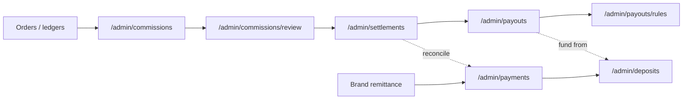

# Payouts domain — UI map

**Live app:** https://app.direct2retailers.com  
**Domain:** Finance / rep compensation (`commissions` → `settlements` → `payouts` → cash ops)  
**Mapped:** 2026-09-16  
**Machine map:** [`interactions.json`](./interactions.json)  
**Parent map:** [`../../SITE-MAP.md`](../../SITE-MAP.md) · [`../../SITE-MAP-INTERACTIONS.json`](../../SITE-MAP-INTERACTIONS.json)  
**Twin code:** `d2r-app/src/app/admin/{commissions,payouts,settlements}/page.tsx`  
**Interaction fidelity:** **inferred** — routes confirmed in vault `URLS.txt`; no authenticated live HTML scrape this pass

---

## Domain purpose

Admin finance module for turning sales activity into rep compensation:

1. **Commissions** — calculate and approve per-rep, per-brand commission lines for a period.
2. **Settlements** — roll brand-level gross/adjustments into settlement batches before payout.
3. **Payouts** — execute rep disbursements (ACH/check) using configured rules.
4. **Payments / deposits** — record inbound brand cash and bank deposits; reconcile against settlements.

Rep-facing apps intentionally **do not** surface payout amounts (merch survey banner: pay terms live in settlement hub).

---

## Workflow (inferred)



---

## Nav tree (this domain)

```
Finance
├── Commissions                       /admin/commissions
│   └── Review                        /admin/commissions/review
├── Settlements                       /admin/settlements
│   └── Batch preview                 /admin/settlements/batch/preview   ← related; out of scope
├── Payouts                           /admin/payouts
│   ├── Rules                         /admin/payouts/rules
│   └── Rules example                 /admin/payouts/rules/example       ← related; out of scope
└── Cash ops
    ├── Payments                      /admin/payments
    └── Deposits                      /admin/deposits
```

**Adjacent (not in scope but linked):**

- `/admin/reports/commissions` — analytics export; links back to commission queue.
- `/admin/receipts` — receipt archive; pairs with payments/deposits.

**Twin nav today:** `commissions`, `settlements`, `payouts` only — no review, rules, payments, or deposits links.

---

## Coverage legend

| Status | Meaning |
|--------|---------|
| `captured` | Live rows/headers scraped into exports |
| `mapped-ui-only` | Route known; controls inferred from URLs + finance patterns |
| `stub-in-twin` | Twin `page.tsx` exists; demo seed only |
| `missing` | No twin page yet |

---

## Route inventory

### `/admin/commissions`

| Field | Value |
|-------|-------|
| **Purpose** | Commission run queue — per rep × brand × period lines awaiting calculation/approval |
| **Coverage** | `stub-in-twin` |
| **Twin page** | Yes — read-only `DataTable` + `StubNote` |
| **Live capture** | None |

**Tables**

| Table | Headers (twin · live hint) |
|-------|--------------------------|
| `commissions` | ID, Rep, Brand, Period, Amount, Status, Updated |

**Filters / comboboxes (inferred live)**

| Control | Options hint |
|---------|--------------|
| `period` | `2026-Q3`, `2026-Q2`, custom range |
| `brand` | ALP, JOEY, … |
| `status` | pending_review, approved, paid, rejected |

**Actions (inferred live)**

| Button | Effect |
|--------|--------|
| Calculate | Re-run commission engine for selected period/brand |
| Approve | Bulk-approve selected rows → review or settlements |
| Export | CSV of filtered commission lines |

**Links out**

- `/admin/commissions/review` — line-level approval
- `/admin/reports/commissions` — analytics
- `/admin/settlements` — next step after approval

**Twin seed (`data/seed/commissions.json`)**

| id | rep | brand | period | amount | status |
|----|-----|-------|--------|--------|--------|
| com-1 | Adam Scott | ALP | 2026-Q3 | $420.50 | pending_review |
| com-2 | Bobby Patel | JOEY | 2026-Q3 | $188.00 | approved |
| com-3 | Adam Scott | JOEY | 2026-Q2 | $95.25 | paid |

**Gaps:** No Calculate/Approve/Export; no filters; no row drill-down; no live export.

---

### `/admin/commissions/review`

| Field | Value |
|-------|-------|
| **Purpose** | Approve, reject, or adjust individual commission lines before settlement |
| **Coverage** | `mapped-ui-only` |
| **Twin page** | No |
| **Live capture** | None |

**Tables (inferred)**

| Table | Headers hint |
|-------|--------------|
| `reviewQueue` | Rep, Brand, Period, Line item, Basis (units/revenue), Rate, Amount, Variance, Status |

**Filters**

| Control | Purpose |
|---------|---------|
| `period` | Focus review on one settlement window |

**Actions**

| Button | Effect |
|--------|--------|
| Approve | Mark line approved; may batch to settlements |
| Reject | Send back with reason |
| Adjust | Inline amount/rate override with audit note |

**Links**

- `/admin/commissions` — back to queue

**Gaps:** Entire route missing in twin; no seed for line-level detail or adjustment audit trail.

---

### `/admin/settlements`

| Field | Value |
|-------|-------|
| **Purpose** | Brand settlement batches — gross sales, adjustments, net payable |
| **Coverage** | `stub-in-twin` |
| **Twin page** | Yes — read-only `DataTable` + `StubNote` |
| **Live capture** | None |

**Tables**

| Table | Headers (twin · live hint) |
|-------|--------------------------|
| `settlements` | ID, Period, Brand, Gross, Adjustments, Net, Status, Created |

**Filters (inferred live)**

| Control | Options hint |
|---------|--------------|
| `period` | Date range / month |
| `brand` | Brand picker |
| `status` | preview, closed, paid |

**Actions**

| Button | Effect |
|--------|--------|
| Create batch | Open `/admin/settlements/batch/preview` for new batch |
| Export | CSV of settlement batches |

**Links out**

- `/admin/settlements/batch/preview` — pre-commit preview
- `/admin/commissions` — upstream
- `/admin/payouts` — downstream after close

**Twin seed (`data/seed/settlements.json`)**

| id | period | brand | gross | adj | net | status |
|----|--------|-------|-------|-----|-----|--------|
| set-2026-09-a | 2026-09-01/2026-09-15 | ALP | $12,400 | -$120 | $12,280 | preview |
| set-2026-08-b | 2026-08-01/2026-08-31 | JOEY | $8,900 | $0 | $8,900 | closed |

**Gaps:** No Create batch, preview flow, or status transitions; Adjustments column only in twin table (live hint omits it in parent map).

---

### `/admin/payouts`

| Field | Value |
|-------|-------|
| **Purpose** | Rep payout runs — ACH/check disbursements tied to a rule |
| **Coverage** | `stub-in-twin` |
| **Twin page** | Yes — read-only `DataTable` + `StubNote` |
| **Live capture** | None |

**Tables**

| Table | Headers (twin · live hint) |
|-------|--------------------------|
| `payouts` | ID, Rep, Method, Amount, Status, Run date, Rule |

**Filters (inferred live)**

| Control | Options hint |
|---------|--------------|
| `status` | scheduled, paid, on_hold, failed |
| `method` | ach, check, wire |

**Actions**

| Button | Effect |
|--------|--------|
| Run payouts | Execute payout batch for approved settlements |
| Export | CSV of payout runs |

**Links out**

- `/admin/payouts/rules` — rule configuration
- `/admin/settlements` — funding source
- `/admin/commissions` — upstream trace
- `/admin/payments` — cash reconciliation (inferred)

**Twin seed (`data/seed/payouts.json`)**

| id | rep | method | amount | status | runDate | rule |
|----|-----|--------|--------|--------|---------|------|
| pay-1 | Adam Scott | ach | $515.75 | scheduled | 2026-09-20 | biweekly-standard |
| pay-2 | Bobby Patel | ach | $188.00 | paid | 2026-09-05 | biweekly-standard |
| pay-3 | Hold - Unknown | check | $50.00 | on_hold | — | manual-review |

**Gaps:** No Run payouts action; no hold/release workflow; no ACH detail or failure retry UI.

---

### `/admin/payouts/rules`

| Field | Value |
|-------|-------|
| **Purpose** | Configure payout rule sets (cadence, method, thresholds, hold conditions) |
| **Coverage** | `mapped-ui-only` |
| **Twin page** | No |
| **Live capture** | None |

**Tables (inferred)**

| Table | Headers hint |
|-------|--------------|
| `payoutRules` | Rule name, Type, Cadence, Method, Min amount, Hold conditions, Active |

**Filters**

| Control | Purpose |
|---------|---------|
| `ruleType` | biweekly-standard, manual-review, brand-specific, … |

**Actions**

| Button | Effect |
|--------|--------|
| Add rule | New rule form |
| Save | Persist rule set |

**Links**

- `/admin/payouts` — back to runs
- `/admin/payouts/rules/example` — docs/example (related route)

**Gaps:** No twin page; rules referenced only as string slugs in payout seed (`biweekly-standard`, `manual-review`).

---

### `/admin/payments`

| Field | Value |
|-------|-------|
| **Purpose** | Inbound payment records — brand remittances, invoice payments, manual entries |
| **Coverage** | `mapped-ui-only` |
| **Twin page** | No |
| **Live capture** | None |

**Tables (inferred)**

| Table | Headers hint |
|-------|--------------|
| `payments` | ID, Date, Payer (brand), Amount, Method, Reference, Status, Linked settlement |

**Filters**

| Control | Options hint |
|---------|--------------|
| `status` | pending, cleared, reconciled |
| `method` | ach, check, wire, card |

**Actions**

| Button | Effect |
|--------|--------|
| Record payment | Manual payment entry form |
| Export | CSV |

**Links out**

- `/admin/deposits` — bank deposit side
- `/admin/receipts` — receipt archive
- `/admin/payouts` — outbound counterpart

**Gaps:** Entire cash-in leg missing in twin; no seed; no reconciliation UI to settlements.

---

### `/admin/deposits`

| Field | Value |
|-------|-------|
| **Purpose** | Bank deposit tracking and reconciliation against recorded payments |
| **Coverage** | `mapped-ui-only` |
| **Twin page** | No |
| **Live capture** | None |

**Tables (inferred)**

| Table | Headers hint |
|-------|--------------|
| `deposits` | ID, Bank account, Deposit date, Amount, Status, Matched payments, Variance |

**Filters**

| Control | Options hint |
|---------|--------------|
| `status` | open, reconciled, exception |

**Actions**

| Button | Effect |
|--------|--------|
| Record deposit | Log bank deposit |
| Reconcile | Match deposit lines to `/admin/payments` |

**Links out**

- `/admin/payments` — payment ledger
- `/admin/receipts` — supporting docs

**Gaps:** Entire route missing; no bank account seed; no match/reconcile workflow.

---

## Domain coverage snapshot

| Route | Live route known | Live data captured | Twin page | Twin interactivity |
|-------|------------------|--------------------|-----------|--------------------|
| `/admin/commissions` | Yes | No | Yes | Read-only table |
| `/admin/commissions/review` | Yes | No | No | — |
| `/admin/settlements` | Yes | No | Yes | Read-only table |
| `/admin/payouts` | Yes | No | Yes | Read-only table |
| `/admin/payouts/rules` | Yes | No | No | — |
| `/admin/payments` | Yes | No | No | — |
| `/admin/deposits` | Yes | No | No | — |

**0 / 7 routes captured.** **3 / 7** have twin scaffolds. **0 / 7** have authenticated UI scrape.

---

## Data dependencies (domain)

| Entity | Twin seed | Live export | Notes |
|--------|-----------|---------------|-------|
| Commission lines | `commissions.json` (3 rows) | missing | Needs rules engine + order/ledger tie-in |
| Settlement batches | `settlements.json` (2 rows) | missing | Gross/adjustments likely from brand sales |
| Payout runs | `payouts.json` (3 rows) | missing | Rule slugs only; no rule definitions |
| Payout rules | — | missing | CTO trail referenced in twin stub |
| Payments | — | missing | — |
| Deposits | — | missing | — |

**Upstream feeds (outside domain, required for parity):**

- `/admin/orders` — PO totals for commission basis
- `/admin/inventory/ledgers` — sell-through / rep attribution
- `/admin/reports/commissions` — analytics cross-check
- `/admin/users` — rep identity for payout destination

---

## Twin alignment notes

- Twin subtitle on commissions page says "Review queue" but lists all statuses — live likely splits list vs `/review`.
- Settlement twin shows `Adjustments` column; parent site map live hint omitted it — keep column when live scrape confirms.
- Payout `on_hold` row (`Hold - Unknown`) implies KYC/banking validation gate before ACH — needs rules + user profile linkage.
- Finance routes absent from rep nav (correct); admin nav should gain sub-links or tabs when review/rules/payments land.
- Signed-out HTML captures under `exports/.../routes/` are Clerk shells only — not usable for this domain.

---

## Next scrape priorities (when browser auth works)

1. CDP extract on all 7 routes: table headers, filter comboboxes, row actions, empty states.
2. Commission review: capture adjust/reject modal fields and audit trail columns.
3. Payout rules: rule form schema (cadence, min, hold triggers).
4. Payments ↔ deposits: reconciliation match UI and exception workflow.
5. Export one populated period (e.g. 2026-Q3) for commissions + settlements + payouts for seed import.
